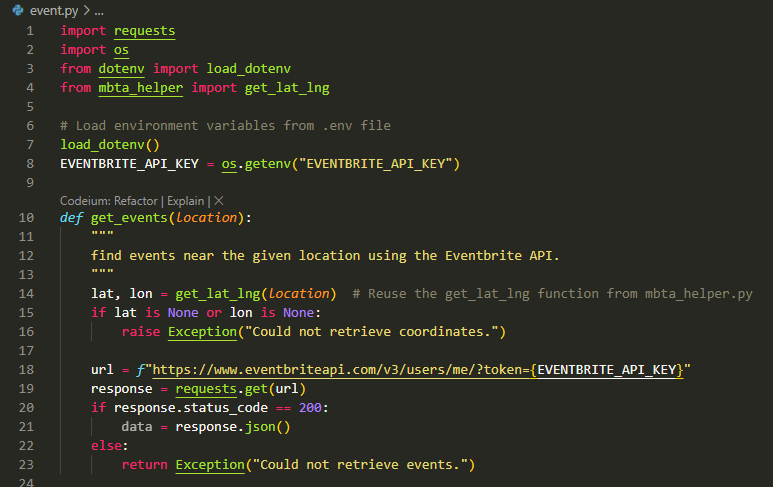
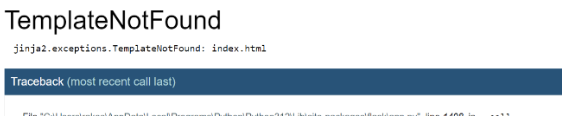

# MBTA-Web-App-Project

This is the base repository for Web App project. Please read the [instructions](instructions.md) for details.
Lisa 
William

**1. Project Overview** (~1 paragraph)

* We created a tool which allows a user to find the nearest MTA publicit stop based on any address or place. Through the use of the weather API as well as the Mapbox API, we were able to transform the address and to a precise longitude and latitude which allowed us to find the nearest transit stop as well as including details about the wheelchair accessibility. We attempted to use the events API from Eventbrite but for some reason it never was able to retrieve the events even though we gave it the correct API and checked.

**2. Reflection** (~3 paragraphs + screenshots)

* We found that the project itself was very interesting in terms of utilizing flask more in general. We found some errors when we ran the MBTA API but we figured out how to deal with them by testing the outputs through printing them out. Though this assignment had a relatively short timeline, we were able to set milestones for when things should be done and found that visualizing the code with pprint helped us with most of the troubleshooting. One specific issue that we came across was running into errors when we tried to run the flask program as well as HTML error messages when we placed location and searched for the place. For some of those errors, we looked at the error message as it was able to give a general area of where we ran into some problems but for a few times, we ended up using chatGPT to explain the errors so that we could create some code that might solve it. One notable area of improvement would be the implementation of the event API since we could not retrieve the data.

* For the teamwork division, we initially planned to split up the work but we found that there was a lot of problems that we came across that would be easier if we were to work together. As a result of this, we ended up creating our code for parts one and two and compared to see what we did better we ended up finding that Lisa's app.py was very effective and I combined both of our MBTA helper files so that the code was more effective. I think that next time when we work together we will create the code together rather than separately as it would have been more time efficient.
* For the most part, I found AI to be helpful especially when there was an error that we couldn't understand and it helped us locate where there is and how we could prevent it in the future. Another really useful aspect was using ChatGPT to check my syntax and formatting for HTML as we are not as familiar with who HTML is written. I found that throughout this project we got better with the syntax and the format. One specific example noted below shows how I got an error message that did not make too much sense and from my perspective, I thought there was something wrong with the index HTML file but after I used ChatGPT to try to explain the error, it told me that the issue lied in where the templates folder was relative to the app.py program.

